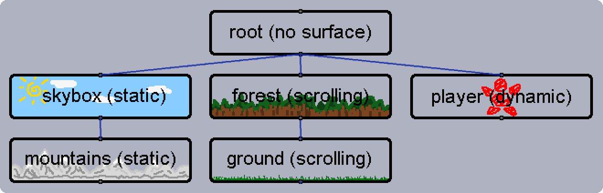

# recurfaces

###### A pygame framework used to organise Surfaces into a chain structure

## Quickstart

Below is an example of recurfaces being used in a basic game loop. When it is run, the game window will display a red square on a white background,
movable by tapping the arrow keys.

```python
import pygame

from recurfaces import Recurface


# pygame setup
pygame.init()
window = pygame.display.set_mode((800, 600))
clock = pygame.time.Clock()

# Creating some recurfaces to display
bg_surface = pygame.Surface((800, 600))
bg_surface.fill("#FFFFFF")
scene = Recurface(surface=bg_surface)  # This is the top-level recurface, and also holds the background surface

red_square_surface = pygame.Surface((64, 64))
red_square_surface.fill("#FF0000")
red_square = Recurface(surface=red_square_surface, position=(100, 100))

scene.add_child_recurface(red_square)

# Game loop
move = [0, 0]
while True:
    clock.tick(60)

    # Moving the red square based on input
    for event in pygame.event.get():
        if event.type == pygame.KEYDOWN:
            if event.key == pygame.K_UP:
                move[1] -= 1
            elif event.key == pygame.K_DOWN:
                move[1] += 1
            elif event.key == pygame.K_LEFT:
                move[0] -= 1
            elif event.key == pygame.K_RIGHT:
                move[0] += 1

    red_square.move_render_position(*move)
    move = [0, 0]

    # Rendering the updated recurfaces
    updated_rects = scene.render(window)
    pygame.display.update(updated_rects)
```

## Structuring Your Recurfaces

Recurfaces are designed to be linked together into chains, and organised broadly into an inverted tree shape; starting with a single
top-level recurface, and branching out at various points into multiple descendants. They are rendered top-down in this structure,
meaning that the parent's surface is rendered onto the window before (and therefore layered underneath) its direct childrens' surfaces.

Siblings under a common parent are rendered in order of their `.priority` attribute - if priority values which support rich comparison with each other
have not been set for all sibling recurfaces under a particular parent, their render order amongst each other will be arbitrary.



A recurface's surface is confined to the area covered by its parent's surface - it can be repositioned out of bounds, or hold a larger
surface than its parent, but when it is rendered any part of it which is not within its parent's surface area will not appear onscreen.

Only one chain of recurfaces should be rendered to each external destination. If you have two or more separate chains  that you want to render
to a single destination, merge them by making a new blank recurface (no surface, and a `.render_position` of `(0, 0)`) and adding both chains
as children of that recurface.

### The Render Pipeline

Recurface objects each store a render pipeline which dictates the steps carried out in that specific object's render process. The default
pipeline simply applies the surfaces from child recurfaces to the current object's surface, and then caches that composited surface for re-use
next frame if no changes which affect the rendered image are made in the interim; this will not require customisation in most cases.

Through this rendering pipeline it is possible to apply filters which make last-minute modifications to a recurface's surface when it is being
rendered - this can include pasting additional layers onto the working copy of the surface, scaling and rotating it, etc. Filters can be created
by importing the PipelineFilter class and passing a function which receives and returns a surface object into its constructor.

- Since the render pipeline is applied to the recurface's stored surface, any recurfaces which themselves have no surface will not implement
  their pipeline during rendering

## General Guidelines

The recurfaces library is designed such that when a top-level recurface is rendered to a destination, the entire chain underneath it is
handled automatically. In order for this to function seamlessly, it is highly recommended to observe the following rules:

- Only one chain of recurfaces should be rendered to each external destination. If you have two or more separate chains
  that you want to render to a single destination, merge them by making a new blank recurface
  (no surface, and a `.render_position` of `(0, 0)`) and adding them both as children of that recurface
- If, during runtime, you wish to change the render destination of a top-level recurface to a new destination, or wish to make visual modifications
  to the render destination through means other than via that recurface chain (resizing it, rendering other surfaces to it etc.),
  call `.flag_destination()` on the top-level recurface to notify it of the changes to its destination before its next render
  - This is not necessary if you are attaching a previously top-level recurface as a child on a different recurface chain, rather than directly rendering that
    recurface to a new destination
  - Once a recurface is no longer rendering to a destination, that destination will have to be managed manually from that point onwards if it remains in use. 
    If (for example) a new recurface will be rendered to it, the destination must first be cleared and updated manually
- If you are modifying a recurface's stored surface in place (rather than replacing it outright), call `.flag_surface()` on that recurface to notify it
  of these modifications before it is next rendered

## Optimisation Tips

###### WIP